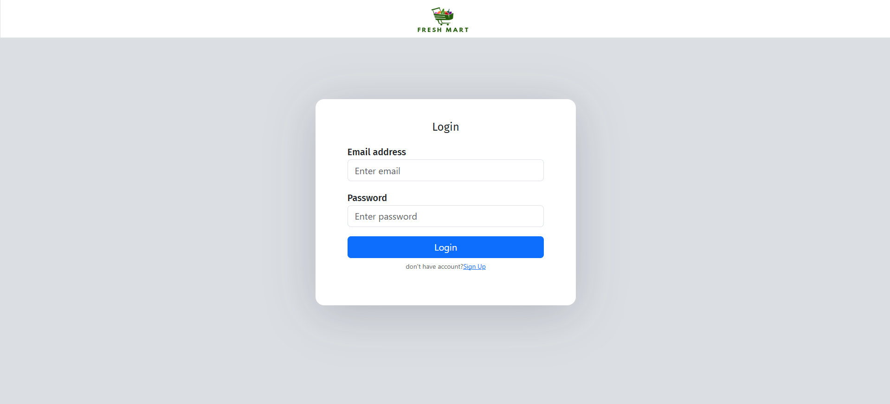
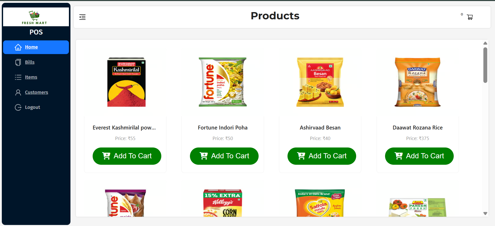
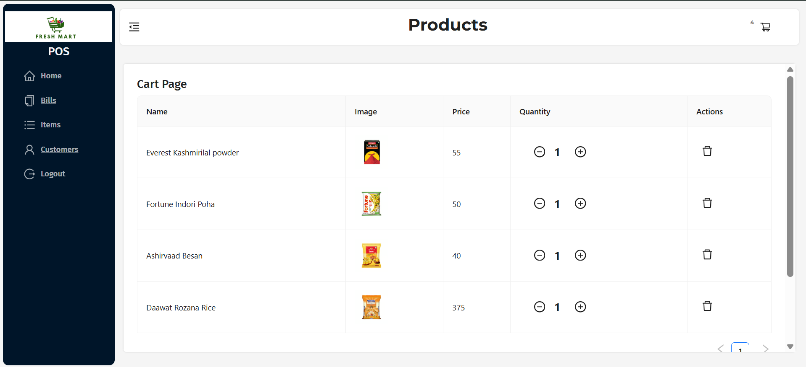
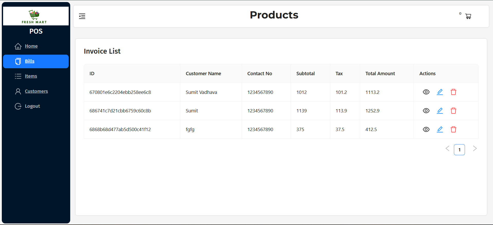
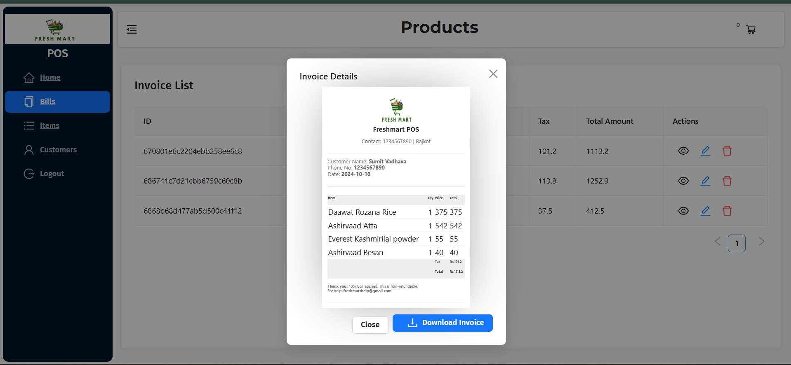
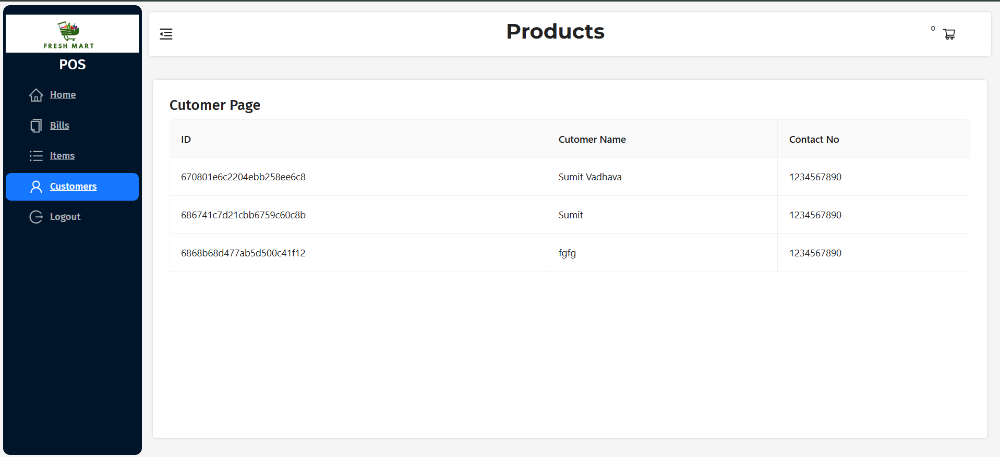

# 🛒 Freshmart - Point of Sale (POS) System

Freshmart POS is a full-stack, responsive, and robust **Point of Sale (POS) System** built using the MERN stack (MongoDB, Express, React, Node.js). Designed for retail and grocery operations, it provides seamless inventory tracking, cart management, user authorization, and dynamic invoice generation with PDF downloads.

---

## 📸 Project Preview & Walkthrough

Here is a visual walkthrough of the Freshmart POS System interface:

### 🔐 1. User Authentication & Home Dashboard
| **Login Page** | **Home Page (Dashboard Grid)** |
|:---:|:---:|
|  |  |

### 🛒 2. Inventory & Cart Management
| **Cart Page** | **Bill Page** |
|:---:|:---:|
|  |  |

### 🧾 3. Generated Invoices & Customer Database
| **Bills Page / PDF Invoice Generator** | **Customer View** |
|:---:|:---:|
|  |  |

---

## ✨ Key Features

### 👤 Authentication & Security
- **Secure Registration & Login**: User authentication powered by JWT (JSON Web Tokens).
- **Password Hashing**: Secure storage of credentials using `bcrypt` salting and hashing on the backend.
- **Route Protection**: Fully client-side protected routes restricting unauthorized access.

### 📦 Inventory & Product Management
- **Add Product**: Easily inject new grocery/retail products with Name, Category, Price, and Image.
- **Edit Product**: Update product info on-the-fly inside dynamic modals.
- **Delete Product**: Seamless product retirement from the inventory database.

### 🛒 Cart & Checkout Management
- **Instant Cart Actions**: Add products, increase/decrease quantities, or remove items with automatic real-time subtotal calculations.
- **Tax & GST**: Automated calculation of standard tax percentages (e.g. 10% GST).
- **Payment Modes**: Seamless selection of payment methods (Cash, Card, UPI).

### 🧾 Invoice & Bills Management
- **PDF Invoice Generation**: Generates clean retail-receipt-style invoice PDFs directly on-client using `jsPDF` and `html2canvas`.
- **Bill History & Customers**: Track all generated invoices and view past customer transactions in a clean tabular view.

---

## 🛠️ Technology Stack

- **Frontend**: React.js, Redux, Ant Design (Antd), Bootstrap CSS, React Router DOM, React-Toastify.
- **Backend**: Node.js, Express.js.
- **Database**: MongoDB Atlas (with Mongoose ODM).
- **Tooling/Libraries**: Concurrently (run both client & server concurrently), Nodemon, JWT, Cryptography, jsPDF.

---

## ⚙️ Project Structure

```
POS System/
├── client/                 # Frontend React Application
│   ├── public/             # Static Assets
│   └── src/                # React Source Code
│       ├── components/     # Layout, Item Cards, Protected Routes
│       ├── pages/          # Homepage, Cart, Bills, Customers, Login, Signup
│       ├── redux/          # Redux Store & Reducers
│       ├── Styles/         # Layout & Invoice Custom Styling
│       └── utils/          # Static Assets & Logo
├── server/                 # Backend Node/Express Application
│   ├── config/             # DB Connection Config
│   ├── controllers/        # Express Route Controllers
│   ├── models/             # Mongoose Schemas (Bills, Items, User)
│   ├── routes/             # Express API Endpoints
│   └── utils/              # Mock Seed Data
├── server.js               # Application Entry Point
└── seeder.js               # Database Seeding Script
```

---

## 🚀 Installation & Local Setup

Follow these simple instructions to set up the project locally:

### 1. Prerequisites
Ensure you have **Node.js** (v16+) and **npm** installed, along with a running **MongoDB** instance (local or Atlas cluster).

### 2. Clone & Install Dependencies
Navigate to the root directory and install node modules for both the backend (root) and the client:

```bash
# Install backend dependencies
npm install

# Install frontend dependencies
cd client
npm install
cd ..
```

### 3. Setup Environment Variables
Create a `.env` file in the **root** folder and configure your port and MongoDB URL:

```env
PORT=7171
db_url=YOUR_MONGODB_CONNECTION_STRING
```

### 4. Seed Database (Optional but Recommended)
Populate your database with the preset default items to see the product grid in action:

```bash
npm run seed
```

---

## ⚡ Running the Application

To run the application in development mode (which starts both the Express backend and React frontend concurrently):

```bash
npm run dev
```

- **Backend** will start on: [http://localhost:7171](http://localhost:7171)
- **Frontend** will start on: [http://localhost:3000](http://localhost:3000)

---

## 👨‍💻 Author

- **Sumit Vadhava** - *Lead Developer*
